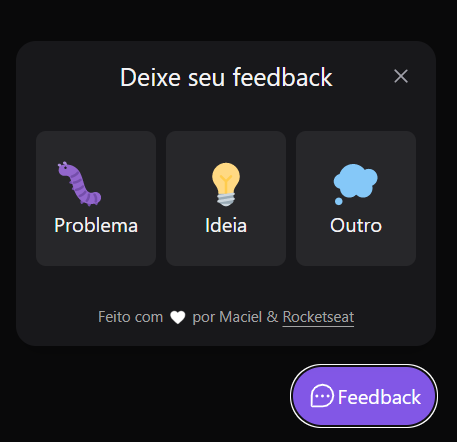
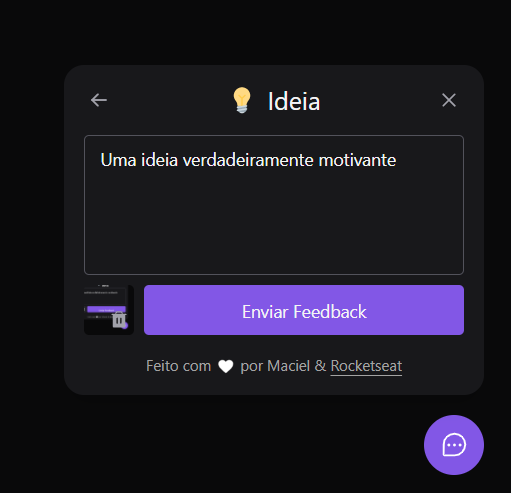
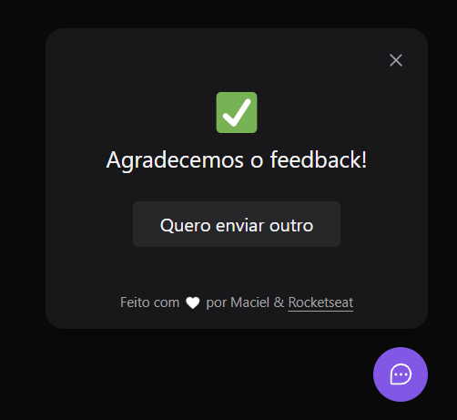

# Aplicativo feito no NLW de número 8 - Return da Rocket seat

- A aplicação se trata de um componente de Widget, criado com React no template de typescript para o nosso front-end e nodejs também utilizando typescript, além de React Native para a versão mobile.
- Várias bibliotecas estão sendo utilizadas para a construção da aplicação, como Express, Prisma e PhosphorIcons, além outras menores.
- A aplicação foi construida seguindo conceitos de SOLID e de desenvolvimento direcionado a testes com JEST e seguindo princípios de SOLID.

#
# Fazendo o APP funcionar

### Instalando dependências e configurando o banco

- Para rodar o app, é necessário entrar na pasta server, na pasta web e na pasta mobile e rodar o seguinte comando:

```
npm install
```

- Depois que todas as dependências foram instaladas, você pode configurar o banco de dados entrando na pasta server e rodando o comando:

```
npx prisma migrate dev
```

- Então o projeto está configurado, agora só rodar! Para ambos back e front, é necessário entrar em cada uma das pastas e então rodar o seguinte comando:

```
npm run dev
```

#

### O caso do mobile

- Para rodar o mobile, é necessário acessar a pasta de mobile e rodar o comando, no caso de já ter rodado o `npm install`:

```
expo start
```

- O servidor do expo ficará disponível para acessar o painél de controle, e por ele é possível conectar ao seu emulador ou de SO mobile, ou através do aplicativo expo go no Android, ou pelo leitor de QR code no IOS.

#
### Configurando o recebimento de emails

- Para que seja possível observar o recebimento de email, você tem que criar uma conta no <a target="_blank" href="https://mailtrap.io">mailtrap</a>, acessar o arquivo `nodemailer-mail-adapter.ts` na pasta `src/adapters/nodemailer` e colocar suas credenciais nos campos:

```
const transport = nodemailer.createTransport({
    host: "smtp.mailtrap.io",
    port: 2525,
    auth: {
        user: "", // Esses campos estão diponíveis na parte de conexão smtp após você criar um projeto
        pass: ""
    }
});
```

- Dessa forma, a inbox do seu app já deve ser capaz de receeber os email da aplicação.

#
### Sucesso!

- Então a aplicação estará rodando no modo de desenvolvimento.

<div align="center">





</div>